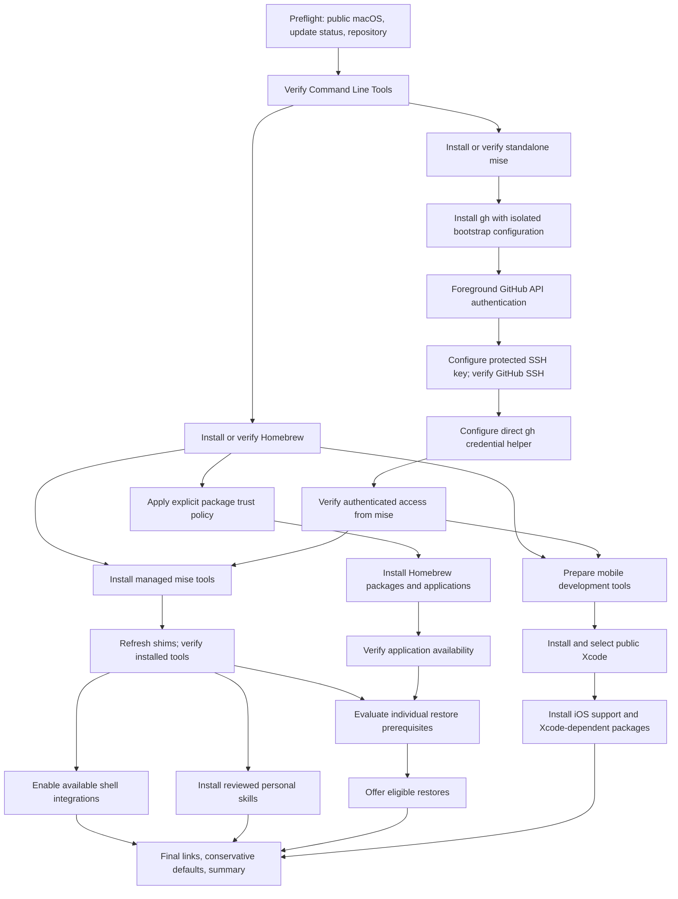

# Reliable and Secure Mac Setup

## Permission restart boundary (implementation update)

The entrypoint now has two explicit phases. `./bin/setup` provisions foundations
(Homebrew and standalone mise concurrently, isolated gh, Codex CLI, Cursor Agent)
and exits before bulk packages or personal configuration links. After reviewing
App Management permission for the actual terminal application and fully quitting
and reopening it when requested by macOS, run `./bin/setup --continue` for
GitHub authentication and the remaining plan. Both phases use persistent live
sanitized diagnostics and the same dependency planner. Continuation rechecks
foundations and acknowledges the manual checkpoint; it does not certify TCC
permission or process restart. Later app-specific prompts remain possible.

## Objective and scope

Repair `./bin/setup` for fresh-machine provisioning, interrupted runs, and partial installations. Preserve the clone → setup workflow, idempotent links with backups, public Apple release policy, and existing package ownership rules.

This document is the agreed implementation plan for the next coding session. Function names below are proposed interfaces. Revalidate findings against the checkout before editing. Read `AGENTS.md` and `DECISIONS.md`; derive behavior from code, not README claims.

Implement the repair and validate it. Do not execute a real machine-wide setup, change account credentials, restore personal backups, or grant system permissions merely to test it. Use isolated fixtures and stubbed external commands; report remaining real-machine validation separately.

## Confirmed failure patterns

- `bin/setup` invokes full-config `mise exec -- gh --version` before authentication. This can provision unrelated missing tools during the authentication phase.
- Authentication and bootstrap failures are recorded as recoverable while dependent installs and restores still execute.
- Bootstrap invokes mise self-update again; update failure can abort provisioning despite a usable mise installation.
- The mise credential command invokes PATH-resolved `gh`; `home/bin/gh` invokes `mise which gh` before its authentication bypass. Remove this circular dependency. Exact recursion in the reported incident was not reproduced.
- Shell startup synchronously initializes optional managed tools; executable shims do not prove installed-tool readiness.
- Runtime cleanup tracks immediate children rather than complete owned process trees. Explicit coordinated SIGINT/SIGTERM handling is absent.
- Background output is hidden; waits provide insufficient progress. Manifest installation can stop on one app failure, skipping independent apps.
- `mise install && mise reshim` skips explicit reshim and validation after partial failure. Restore prerequisites are not independently verified.
- Missing backups and GUI restore handoffs can be reported as completed restores.
- Dry-run does not traverse the same orchestration as a normal run.

Evidence qualifications: current bootstrap installs Homebrew before its linking pass, current Brewfiles already declare tap trust, and the macOS update probe already has a 120-second timeout. Do not treat screenshot discrepancies as proof that these safeguards are absent. Existing syntax checks and all seven update-policy tests passed during analysis; they do not cover orchestration defects.

## Execution flow

Arrows represent prerequisites. Independent branches may execute concurrently. Interactive authentication remains in the foreground. Serialize writes to each shared package-manager resource, including writes from helper scripts.



Keep API and SSH readiness separate even though setup presents them sequentially. SSH authentication does not raise GitHub API limits; verified API credentials do. An SSH-only failure must not invalidate successful API authentication. Homebrew may continue independently when GitHub authentication fails. Full mise installation waits for Homebrew because individual backends can require its dependencies.

## Proposed call hierarchy

```text
bin/setup
├── runtime.initialize()
│   ├── initialize_persistent_trace()
│   ├── acquire_setup_lock()
│   └── register_exit_and_signal_handlers()
├── preflight()
│   ├── check_public_macos_and_update_status()
│   ├── check_repository_and_script_syntax()
│   └── ensure_command_line_tools()
├── provision_foundations()
│   ├── background: ensure_homebrew()
│   └── background: ensure_mise_standalone(skip_update=true)
├── prepare_github_access()                 # requires mise
│   ├── install_gh_isolated()
│   ├── resolve_real_gh_executable()
│   ├── authenticate_and_verify_github_api()
│   ├── configure_and_verify_github_ssh()
│   ├── configure_direct_credential_helper()
│   └── verify_mise_github_access()
├── provision_dependencies()
│   ├── install_homebrew_inventory()        # requires Homebrew + trust
│   ├── install_mise_inventory()            # requires Homebrew + API auth
│   ├── install_mobile_stack()              # explicit Xcode prerequisites
│   ├── install_app_store_apps()            # requires mas + account
│   └── install_editor_extensions()         # requires editor
├── validate_capabilities()
│   ├── refresh_shims_after_partial_install()
│   ├── verify_required_executables()
│   └── verify_required_applications()
├── configure_environment()
│   ├── link_dotfiles_with_backups()
│   ├── enable_available_shell_integrations()
│   └── apply_conservative_defaults()
├── restore_eligible_state()
│   ├── mackup: executable + hydrated backup
│   ├── raycast: application + export
│   └── codex: age + validated archive + confirmation
├── install_personal_skills()               # requires verified runtime
└── summarize_and_exit()
```

This is a logical hierarchy, not a requirement to wait for both foundation jobs before starting gh acquisition. Start gh work when mise is ready. Link configuration needed by an installer or service before that consumer runs; final linking is reconciliation. Restore prerequisites are per restore, not a global all-applications gate.

## Implementation requirements

| Area | Required behavior |
| --- | --- |
| Foundations | Install Homebrew and standalone mise concurrently after Command Line Tools readiness. Remove unconditional mise self-update from setup; keep upgrades explicit. |
| GitHub bootstrap | Use isolated configuration containing only bootstrap requirements. Do not use full-inventory `mise exec` for checks or login. Explicit tool arguments alone do not isolate the remaining configuration. Handle initial unauthenticated gh acquisition failure without starting broad downloads. |
| Credential helper | Invoke a resolved real gh binary directly, without mise, a shim, or the account-routing wrapper. Resolve/update the path safely after gh version changes. Preserve account-routing behavior for ordinary user commands. Never print tokens or persist them in tracked configuration. |
| Scheduling | Represent dependencies and verified capabilities explicitly. Continue independent work; block consumers of failed prerequisites. Respect existing mobile opt-out and serial mode. Avoid an unnecessary orchestration framework. |
| Results | Distinguish `completed`, `failed`, `blocked`, `deferred`, and `cancelled`; use `planned` for simulated actions. Incomplete required work must produce nonzero status. Do not equate recoverability with safe downstream execution. |
| Cancellation | SIGINT stops scheduling, terminates/reaps owned descendants with bounded escalation, releases locks, preserves logs, and exits 130. SIGTERM does the same and exits 143. Do not kill unrelated processes. Handle nested helpers and sudo keepalive. |
| Progress | Show stage names, elapsed time, and log paths. Surface long-running progress; keep prompts visible. Serial mode must remain diagnosable. |
| Retries | Bound network retries and waits; report rate-limit reset information. Do not repeatedly retry exhausted quotas. Keep legitimate long installs observable and cancellable. |
| Package writes | Serialize Homebrew writers and mise writers across helpers. Aggregate per-package failures instead of aborting unrelated manifest entries. |
| Partial setup | Refresh available shims after partial installation, preserving the original failure. Validate real executables including gh, age, mackup, and required runtimes, rather than accepting shim presence. |
| Shell startup | Optional integrations tolerate missing tools. Prompt initialization must not install tools or depend on network access. Preserve standalone executable priority without reentrant discovery. |
| Restores | Check executable/application readiness and readable, hydrated backups before prompting. Preserve archive validation, backups, and conflict staging. Missing backup means skipped/deferred; GUI import means pending manual completion. |
| Dry-run | Traverse the same dependency planner with provisioning mutations disabled. Identify any executed external probes separately. Writing the requested diagnostic logs is intentional. |
| Documentation | Update DECISIONS.md for changed architecture and README.md for actual behavior, recovery commands, logs, and manual steps. |

## Persistent execution tracing: required in every run

Tracing is enabled by default for both normal setup and dry-run; no debug flag is required.

- Store each run under `.local/setup-runs/<run-id>/`; add the runtime directory to `.gitignore`. Keep logs machine-local, with restrictive directory/file permissions.
- Write `events.jsonl`, `summary.txt`, and separate sanitized stage-output logs. Print the run directory immediately and in the final summary. Preserve partial logs after failure or cancellation.
- Record run mode, repository commit and dirty state, timestamps, stage ID, parent stage ID, prerequisites, lifecycle events, duration, outcome, and exit status. Use stable IDs to reconstruct the logical call hierarchy across parallel processes.
- Capture Bash source file, function, and line number on failures using `BASH_SOURCE`, `FUNCNAME`, and `BASH_LINENO`. Capture explicitly handled failures as well as uncaught ones; an ERR trap alone is insufficient. Do not rely on traps changing existing error semantics.
- Prevent concurrent writers from corrupting JSONL records; merge per-process streams or use an appropriately serialized writer. Retain causality through IDs rather than assuming timestamps give a total execution order.
- Normal runs record actual execution and failure stacks. Dry-runs record planned actions, dependency decisions, and checks actually executed. Never label simulated actions as executed or invent runtime stacks for them.
- Do not use blanket `set -x`, dump environments, or indiscriminately record command arguments/authentication output. Redact sensitive output and omit token-bearing streams by design. Gitignore is not a confidentiality control.
- Document how a future agent can locate and inspect a run. Add a practical retention policy without silently deleting logs needed to diagnose the current failure.

Example human-readable trace:

```text
setup
├── preflight                         completed
├── foundations
│   ├── homebrew                      completed
│   └── mise                          completed
└── github
    ├── install_gh                    completed
    ├── authenticate_api              failed
    └── verify_mise_access             blocked: authenticate_api
```

## Security workstream

Implement repository-level changes without modifying existing personal credentials or bypassing macOS consent:

- Stop generating SSH private keys with an empty passphrase by default. Support a protected key or approved SSH agent; preserve existing identities until the user explicitly migrates them.
- Validate GitHub SSH host keys against GitHub's published fingerprints instead of blindly accepting `ssh-keyscan` output.
- Remove automatic NearDrop quarantine removal, including for already-present app bundles.
- Preserve tap trust enforcement; prefer package-specific trust where practical. Never introduce a global trust bypass.
- Review package-execution policy across shell wrappers, direct Bun calls, Bash installers, and personal skills. Do not claim Socket Firewall wrappers cover execution paths they do not intercept.
- Separate upgrades from recovery provisioning. Pin bootstrap-critical inputs, retain release-age protection, and review unnecessary tools/extensions and mutable skill sources.
- Preserve sensible display sleep and screen locking. Use temporary keep-awake for long operations instead of permanent sleep disabling.
- Review executable configuration, extensions, skills, and automations before restoring them from backups following a compromise.
- Evaluate LuLu, BlockBlock, an SSH-agent solution such as 1Password, and optional KnockKnock/ReiKey diagnostics. Verify current distribution routes and ownership (`mas → mise → Homebrew`) before inventory changes. Do not silently choose a paid service or treat installed security software as configured protection; record manual permission requirements and limitations.
- Document a disposable interview environment without personal credentials, host HOME mounts, SSH-agent forwarding, or signed-in personal browsers. Explain selective macOS file protections, least-privilege permissions, credential rotation after exposure, and why FileVault does not prevent same-session credential theft.

Reference documentation to recheck when implementing:

- [mise exec](https://mise.jdx.dev/cli/exec) and [GitHub credentials](https://mise.jdx.dev/dev-tools/github-tokens)
- [Homebrew tap trust](https://docs.brew.sh/Tap-Trust)
- [GitHub SSH fingerprints](https://docs.github.com/en/authentication/keeping-your-account-and-data-secure/githubs-ssh-key-fingerprints)
- [1Password SSH authorization](https://developer.1password.com/docs/ssh/agent/security/)
- [Objective-See tools](https://objective-see.org/tools.html)

## Implementation sequence

1. Runtime lifecycle, persistent tracing, cancellation, process ownership, and focused tests.
2. Parallel foundation installation, isolated gh acquisition, direct credential helper, and authentication tests.
3. Explicit prerequisite handling, serialized package writes, partial-install recovery, and accurate results.
4. Resilient shell startup, prerequisite-gated restores, and shared dry-run planning.
5. Repository security changes, tool evaluation, documentation, and complete validation.

## Acceptance tests

Use isolated HOME/config/state directories and fake external commands. Tests must not invoke real installers, account changes, restore operations, or system defaults.

- Fresh environment with neither Homebrew nor mise installed; demonstrate foundation overlap and dependency ordering.
- One foundation failure does not incorrectly cancel independent work or enable dependent work.
- gh bootstrap does not load the full inventory; failed login and HTTP 403 do not start a broad download storm.
- Credential helper does not recurse through mise/wrappers and remains valid after gh upgrades.
- SSH-only failure remains distinct from API authentication failure.
- Partial mise installation preserves failure status while making successfully installed tools usable.
- First manifest app failure does not skip unrelated apps; absent Homebrew is not reported as successful installation.
- SIGINT/SIGTERM with child and grandchild processes leave no owned jobs or stale locks; unrelated processes survive; logs remain readable.
- Reruns preserve successful installations, existing data, link backups, and user state without unnecessary upgrades.
- Missing restore tools/apps, unavailable backups, conflicts, and GUI handoffs receive accurate outcomes.
- Shell startup works with incomplete tools and unavailable networking, without launching provisioning or credential recursion.
- Both normal runs and dry-runs create traces with correct parent-child relationships, dependency decisions, failure locations, and cancellation events.
- Concurrent events remain parseable; synthetic credentials do not appear in logs. Dry-run distinguishes plans from actual probes.
- Existing public-release/update-policy tests continue to pass. Run relevant Bash/zsh syntax checks, `git diff --check`, and safe shared-planner dry-run checks.

## Completion criteria

The implementation and tests establish the behaviors above; README and DECISIONS match the code; normal and dry-run traces are available for inspection. Report changed behavior, validation results, remaining manual security-tool decisions, and any real-machine checks that were intentionally not performed. Do not claim a successful fresh-Mac installation based only on mocked tests.
