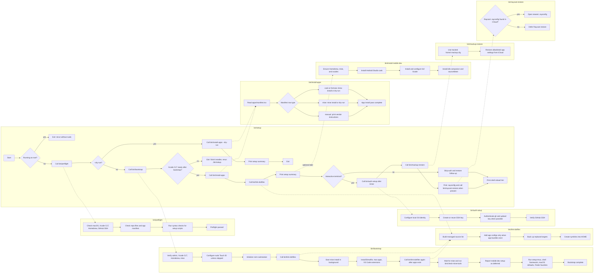

# dotfiles

Source of truth for rebuilding my macOS development environment without
committing secrets, auth state, or machine-local noise.

The main path is intentionally simple:

```bash
mkdir -p ~/development
git clone https://github.com/gabimoncha/dotfiles.git ~/development/dotfiles
cd ~/development/dotfiles
./bin/setup
```

Run `./bin/setup` without `sudo`. The scripts ask for a password only when a
specific privileged macOS or Homebrew step needs it.

## Setup Steps

### Step 1: Prepare the old Mac

Do this before moving to a new machine, or whenever you want to check whether
the repo still reflects the current Mac.

```bash
cd ~/development/dotfiles
./bin/prepare-sync
./bin/mackup-backup
./bin/raycast-backup
```

`bin/prepare-sync` is a drift report, not an auto-writer. It compares the
current Homebrew bundle, prints the current `mise` state, and saves backups
under `.sync-backups/` so changes can be made intentionally.

`bin/mackup-backup` copies the small Mackup allowlist to iCloud. Raycast is not
managed by Mackup here; `bin/raycast-backup` opens Raycast and tells you to save
an encrypted `.rayconfig` export under `iCloud Drive/Raycast`.

Commit and push any intentional repo changes before switching machines.

### Step 2: Clone on the new Mac

```bash
mkdir -p ~/development
git clone https://github.com/gabimoncha/dotfiles.git ~/development/dotfiles
cd ~/development/dotfiles
./bin/setup
```

If Xcode Command Line Tools are missing, setup opens Apple's installer popup
and exits. Finish the installer, then rerun:

```bash
./bin/setup
```

### Step 3: Let setup do the unattended work

`bin/setup` is the fresh-machine entrypoint. Each container below is a script
flow, and arrows between containers show where setup hands control to another
script.



It is safe to rerun as Apple ID, App Store, iCloud, Xcode, or app permissions
become ready. The detailed bootstrap inventory is in
[`What Setup Actually Does`](#what-setup-actually-does).

Dry-run the install pass without changing the machine:

```bash
./bin/setup --dry-run
```

### Step 4: Finish auth and restore

At the end of setup, press Enter to continue the interactive follow-up. You can
also run the pieces directly later:

```bash
./bin/auth-setup
./bin/mackup-restore
./bin/raycast-restore
```

`bin/auth-setup` configures local Git identity, creates or reuses an Ed25519 SSH
key, authenticates GitHub CLI, uploads the SSH key when possible, and verifies
GitHub SSH.

`bin/mackup-restore` expects iCloud Drive and the tracked `home/.mackup.cfg`.
`bin/raycast-restore` opens the newest `.rayconfig` it can find under iCloud
Drive, or an explicit path passed as an argument.

`bin/finder-sidebar-favorites` creates `~/development` and `~/Screenshots`,
then adds both folders to Finder Favorites. It is run during setup and can be
rerun later if macOS privacy prompts or Finder state get in the way. The
sidebar label is `screenshots`; the folder path remains `~/Screenshots`.

### Step 5: Handle manual account and permission work

Some state cannot be safely automated:

- Apple ID, App Store, and iCloud sign-in
- Cursor, VS Code Settings Sync, Notion, Synology Drive, superwhisper, and
  DaVinci Resolve sign-in
- Accessibility, Automation, Microphone, and network permissions
- first-run setup for Xcode, Android Studio, OrbStack, and vendor-only apps
- Android Studio SDK setup for React Native: install Android 15 SDK Platform
  35, Sources for Android 35, Android SDK Build-Tools, Android Emulator, and
  create at least one virtual device from Virtual Device Manager

The heavyweight mobile dev stack is intentionally outside the default setup
path. Run it when you are ready for the large Xcode and Android Studio
downloads:

```bash
./bin/install-mobile-dev
```

Manual/vendor apps currently live in `apps/manifest.tsv` as `manual` rows.
DaVinci Resolve and Pinokio are examples.

### Step 6: Verify app state

If the machine looks mostly set up but a few pieces feel incomplete, run:

```bash
./bin/app-state-doctor
```

It checks the app-state edges this repo can reason about: AeroSpace and Ghostty
config links, tmux plugins, Raycast install/export state, Touch ID for `sudo`,
and whether Spotlight is still holding Command-Space.

## What Setup Actually Does

`bin/bootstrap` is the lower-level installer used by `bin/setup`.

It:

1. verifies macOS, admin access, Xcode Command Line Tools, Homebrew, and `mise`
2. enables Touch ID for `sudo` through `/etc/pam.d/sudo_local` when supported
3. initializes the Neovim submodule
4. links tracked files from `home/` into `$HOME`
5. starts `mise install` in the background
6. installs Homebrew formulae, casks, App Store apps, and VS Code extensions
   with `brew bundle --jobs="${DOTFILES_BREW_BUNDLE_JOBS:-auto}"`
7. skips casks whose app bundle already exists in `/Applications`
8. defers App Store apps until `mas` and App Store sign-in are usable
9. defers the heavyweight mobile dev stack to `./bin/install-mobile-dev`
10. verifies `mise` tools with `bin/check-mise-tools`
11. installs tmux plugins through TPM
12. installs Oh My Zsh and Powerlevel10k when missing
13. applies tracked macOS defaults once

Touch ID for `sudo` can be managed directly:

```bash
./bin/configure-sudo-touch-id --check
./bin/configure-sudo-touch-id --enable
./bin/configure-sudo-touch-id --disable
```

Skip this during setup when needed:

```bash
DOTFILES_SKIP_SUDO_TOUCH_ID=1 ./bin/setup
```

Apple Watch approval depends on macOS Auto Unlock being enabled in System
Settings. This repo configures the `sudo` Touch ID PAM hook, not Apple Watch
pairing or unlock settings.

The macOS defaults can be skipped for a run:

```bash
DOTFILES_SKIP_MACOS_DEFAULTS=1 ./bin/bootstrap
```

Run the mobile dev stack separately when you want full Xcode, Android Studio,
`idb-companion`, and `sourcekitten`:

```bash
./bin/install-mobile-dev
```

## Ownership Model

This repo is deliberately boring about ownership:

- `Brewfile` owns Homebrew formulae, casks, taps, App Store app entries,
  and VS Code extensions.
- `home/.config/mise/config.toml` owns language runtimes and global developer
  tools that `mise` supports, including backend-prefixed tools such as
  `gem:fastlane` and `conda:aria2`.
- `apps/manifest.tsv` is the typed ledger for extra install handling.
- `home/` owns files that get symlinked into `$HOME`.
- `macos/defaults.sh` owns conservative macOS defaults.
- `nvim/` is a separate Neovim repo mounted here as a submodule.
- Mackup owns only the allowlisted app settings in `home/.mackup.cfg`.
- Raycast is restored from an encrypted `.rayconfig` export outside git.

When adding a tool, use this order:

1. Mac App Store via `mas`, if it is a GUI app available there
2. `mise`, if `mise ls-remote <tool>` or an appropriate backend-prefixed id
   supports it
3. Homebrew in `Brewfile`, if it does not belong in `mas` or `mise`
4. `apps/manifest.tsv`, if it needs special handling or is manual/vendor-only

Do not commit secrets, tokens, private emails, `.rayconfig` files, cache
databases, session state, or machine-local exports.

## Important Paths

```text
Brewfile                         Homebrew, mas, casks, VS Code extensions
apps/manifest.tsv                extra typed app/tool ledger
bin/setup                        fresh-Mac entrypoint
bin/bootstrap                    lower-level bootstrap
bin/link-dotfiles                symlink managed files into $HOME
bin/preflight                    repo and machine checks
bin/auth-setup                   Git/GitHub/SSH follow-up
bin/configure-sudo-touch-id      Touch ID for sudo PAM setup
bin/install-apps                 manifest installer
bin/install-mobile-dev           heavyweight Xcode and Android Studio setup
bin/finder-sidebar-favorites     add repo-owned Finder sidebar favorites
bin/app-state-doctor             post-setup app-state checks
home/                            tracked $HOME sources
home/.config/mise/config.toml    mise-owned tools
home/.mackup.cfg                 Mackup allowlist using iCloud storage
macos/defaults.sh                tracked macOS defaults
nvim/                            Neovim submodule linked to ~/.config/nvim
```

## Managed Dotfiles

`bin/link-dotfiles` links tracked files into `$HOME` and backs up replaced
targets under `~/.dotfiles-backups/<timestamp>/`.

Currently managed:

- `~/.gitconfig`
- `~/.aerospace.toml`
- `~/.zshenv`, `~/.zprofile`, `~/.zshrc`
- `~/.p10k.zsh`
- `~/.mackup.cfg`
- `~/.rgrc`
- `~/.tmux.conf`
- `~/.config/mise/config.toml`
- `~/.config/zsh/*.zsh`
- `~/.config/karabiner/karabiner.json`
- `~/.config/zed/settings.json`
- `~/.config/zed/keymap.json`
- `~/Documents/superwhisper/settings/settings.json`
- `~/Library/Application Support/com.mitchellh.ghostty/config`
- `~/scripts/toggle_function_keys.sh`
- `nvim/` as `~/.config/nvim`

AeroSpace and Ghostty config links are only created after their app bundles
exist in `/Applications`.

## Shell Layout

The tracked zsh files are thin entrypoints:

- `home/.zshenv`
- `home/.zprofile`
- `home/.zshrc`
- `home/.config/zsh/path.zsh`
- `home/.config/zsh/env.zsh`
- `home/.config/zsh/profile.zsh`
- `home/.config/zsh/interactive.zsh`
- `home/.config/zsh/aliases.zsh`
- `home/.config/zsh/mise-npx.zsh`
- `home/.config/zsh/functions.zsh`
- `home/.config/zsh/check-updates.zsh`

Machine-local secrets and exports belong in ignored files under:

```text
~/.config/local/*.zsh
home/.config/local/*.zsh
```

Use `home/.config/local/secrets.zsh.example` as the template for repo-local
secret exports. The real `secrets.zsh` file stays untracked.

Use environment variables for secrets and the zsh `path` array for committable
PATH setup.

Infisical wrappers are available for separate work and personal service tokens:

```zsh
infisical-work run --env=dev -- bun dev
infisical-personal run --env=dev -- npm run dev
infisical-work export --env=prod --format=json
infisical-personal secrets get SOME_KEY --env=dev
```

They support `run`, `export`, and `secrets`, using `INFISICAL_WORK_TOKEN` or
`INFISICAL_PERSONAL_TOKEN` from local secrets. Optional
`INFISICAL_WORK_API_URL` and `INFISICAL_PERSONAL_API_URL` values are passed to
the CLI as `--domain`.

`home/.config/zsh/mise-npx.zsh` wraps `npx` and `px` so one-off npm package CLIs
use the `[settings.npm].package_manager` value resolved by `mise`. The global
default in `home/.config/mise/config.toml` is `bun`, while a project `mise.toml`
can override it to `pnpm` or `aube`. Use `bx` or `bunx` when you explicitly want
Bun regardless of the project setting, and use `command npx` for the real npm
binary when an npx-only flag is required. The file includes comments with the
minimal adoption steps for sharing it outside this repo.

For Android/React Native development, the tracked shell config exports
`JAVA_HOME` to the Homebrew Zulu 17 JDK and `ANDROID_HOME` to
`~/Library/Android/sdk`, then adds the Android emulator and platform-tools
directories to `PATH`. The JDK `bin` directory is placed before `mise` shims so
Java tools such as `keytool` come from the configured JDK instead of stale
runtime shims. Run `./bin/install-mobile-dev` to install Android Studio. Android
Studio still owns installing the SDK packages and creating the emulator image.

To get the Android debug signing SHA-1, use the real debug keystore path:

```bash
keytool -list -v -keystore "$HOME/.android/debug.keystore" -alias androiddebugkey -storepass android -keypass android
```

When a clean shell does not have `mise` shims on `PATH`, prefer:

```bash
mise exec -- <command>
```

## Mackup and Raycast

Mackup uses iCloud storage and an explicit app allowlist:

```bash
./bin/mackup-backup
./bin/mackup-restore
```

The allowlist currently includes Cursor, Cyberduck, Rectangle, Spotify, VS Code,
GitHub CLI, Lazygit, and Stats.

Use the helper scripts instead of raw Mackup link mode. This repo treats Mackup
as an explicit copy-based backup/restore tool so tracked files under `home/`
remain the source of truth.

Raycast is separate:

```bash
./bin/raycast-backup
./bin/raycast-restore
```

Keep `.rayconfig` exports and passphrases outside git.

## Neovim

`nvim/` is a git submodule with separate history. `bin/link-dotfiles` links it
to:

```text
~/.config/nvim
```

Do not edit the submodule from this repo unless the task is explicitly about
the Neovim config repo.

## Updating an Existing Mac

Pull repo updates and reapply bootstrap-managed changes:

```bash
dotfiles-update
```

That command runs `git pull --ff-only` and then `bin/bootstrap` with macOS
defaults skipped for the update run.

For targeted reruns:

```bash
./bin/preflight
./bin/bootstrap
./bin/install-apps
./bin/install-mobile-dev
./bin/link-dotfiles
./bin/setup-tmux
./bin/app-state-doctor
```

## Validation

After meaningful changes, run the smallest relevant checks:

```bash
bash -n bin/bootstrap
bash -n bin/install-mobile-dev
bash -n bin/link-dotfiles
bash -n macos/defaults.sh
git diff --check
```

For setup or inventory changes, also run:

```bash
./bin/preflight
./bin/install-apps --dry-run
./bin/install-mobile-dev --dry-run
./bin/setup --dry-run
```

Keep `README.md`, `QUICKSTART.md`, scripts, and tracked config aligned. If the
implementation changes, update the docs in the same patch.
