# dotfiles

Source of truth for rebuilding my macOS development environment without
committing secrets, auth state, or machine-local noise.

The main path is intentionally simple:

```bash
mkdir -p ~/development
git clone https://github.com/gabimoncha/dotfiles.git ~/development/dotfiles
cd ~/development/dotfiles
./bin/setup
```

Run `./bin/setup` without `sudo`. The scripts ask for a password only when a
specific privileged macOS or Homebrew step needs it.

By default, setup includes the full mobile development stack and overlaps safe
download-heavy work such as Xcode, Homebrew, `mise`, Android Studio, MAS apps,
and VS Code extensions. Use `./bin/setup --skip-mobile-dev` when you do not want
the Xcode/Android downloads on a run, or `./bin/setup --serial` when debugging.

## Setup Steps

### Step 1: Prepare the old Mac

Do this before moving to a new machine, or whenever you want to check whether
the repo still reflects the current Mac.

```bash
cd ~/development/dotfiles
./bin/prepare-sync
./bin/file-backup
```

`bin/prepare-sync` is a drift report, not an auto-writer. It compares the
current Homebrew bundle, prints the current `mise` state, and saves backups
under `.sync-backups/` so changes can be made intentionally.

`bin/file-backup` runs the file-backed state workflow. It copies the small
Mackup allowlist to Synology Drive and mirrors it to iCloud on a best-effort
basis when iCloud is ready, creates the passphrase-encrypted Codex archive, and
opens Raycast with instructions to export an encrypted `.rayconfig` under
`SynologyDrive-personal/MacBackups/Raycast`. The Raycast step prints a full
timestamped save path such as
`raycast-settings-YYYYMMDD-HHMMSS.rayconfig` and copies it to the clipboard when
possible. Rerun `./bin/file-backup raycast` after the Raycast export to mirror
the newest export to iCloud.

If Mackup asks before replacing existing backup copies, pass its option through
the top-level helper:

```bash
./bin/file-backup --force
```

Commit and push any intentional repo changes before switching machines.

### Step 2: Clone on the new Mac

```bash
mkdir -p ~/development
git clone https://github.com/gabimoncha/dotfiles.git ~/development/dotfiles
cd ~/development/dotfiles
./bin/setup
```

If Xcode Command Line Tools are missing, setup opens Apple's installer popup
and exits. Finish the installer, then rerun:

```bash
./bin/setup
```

### Step 3: Let setup do the unattended work

`bin/setup` is the fresh-machine entrypoint. Each container below is a script
flow, and arrows between containers show where setup hands control to another
script.

```mermaid
flowchart LR
  subgraph Setup["bin/setup"]
    direction TB
    S0["Start"]
    S1{"Running as root?"}
    S2["Exit: rerun without sudo"]
    S3["Call bin/preflight"]
    S4{"--dry-run?"}
    S5["Preview mobile-dev and app installs"]
    S6["Print final actionable summary"]
    S7["Exit"]
    S8["Call bin/bootstrap"]
    S9{"Xcode CLT ready after bootstrap?"}
    S10["Exit: finish installer, rerun ./bin/setup"]
    S11["Call bin/install-apps"]
    S12["Call bin/link-dotfiles"]
    S13["Print manifest summary"]
    S14{"Interactive terminal?"}
    S15["Skip auth and restore follow-up"]
    S16["Call bin/auth-setup after Enter"]
    S17["Call bin/file-restore mackup"]
    S18["Find .rayconfig and call bin/file-restore raycast when present"]
    S19{"Encrypted Codex state archive found?"}
    S20["Prompt and call bin/file-restore codex when approved"]
    S21["Defer Codex restore"]
    S22["Print shell reload hint and final actionable summary"]

    S0 --> S1
    S1 -->|"yes"| S2
    S1 -->|"no"| S3
    S3 --> S4
    S4 -->|"yes"| S5 --> S6 --> S7
    S4 -->|"no"| S8
    S8 --> S9
    S9 -->|"no"| S10
    S9 -->|"yes"| S11 --> S12 --> S13 --> S14
    S14 -->|"no"| S15 --> S22
    S14 -->|"yes"| S16 --> S17 --> S18 --> S19
    S19 -->|"yes"| S20 --> S22
    S19 -->|"no"| S21 --> S22
  end

  subgraph Preflight["bin/preflight"]
    direction TB
    P1["Check macOS, Xcode CLT, Homebrew, GitHub SSH"]
    P2["Check repo files and app manifest"]
    P3["Run syntax checks for setup scripts"]
    P4["Preflight passed"]

    P1 --> P2 --> P3 --> P4
  end

  subgraph Bootstrap["bin/bootstrap"]
    direction TB
    B1["Verify admin, Xcode CLT, Homebrew, mise"]
    B2["Configure sudo Touch ID unless skipped"]
    B3["Initialize nvim submodule"]
    B4["Call bin/link-dotfiles"]
    B5["Prepare xcodes and aria2, then start Xcode install"]
    B6["Start mise install and run brew bundle"]
    B7["Run Android Studio, MAS apps, and VS Code extensions"]
    B8["Call bin/link-dotfiles again after apps exist"]
    B9["Run iOS platform support and Xcode-dependent formulae"]
    B10["Run setup-tmux, shell framework, macOS defaults, Finder favorites"]
    B11["Bootstrap complete"]

    B1 --> B2 --> B3 --> B4 --> B5 --> B6 --> B7 --> B8 --> B9 --> B10 --> B11
  end

  subgraph InstallApps["bin/install-apps"]
    direction TB
    I1["Read apps/manifest.tsv"]
    I2{"Manifest row type"}
    I3["cask or formula: brew install or dry-run"]
    I4["manual: print vendor instructions"]
    I5["App install pass complete"]

    I1 --> I2
    I2 --> I3 --> I5
    I2 --> I4 --> I5
  end

  subgraph MobileDev["bin/install-mobile-dev"]
    direction TB
    MD1["Ensure Homebrew, mise, xcodes, and aria2"]
    MD2["Install and select full Xcode"]
    MD3["Install Android Studio cask"]
    MD4["Install iOS platform support"]
    MD5["Install applesimutils, idb-companion, and sourcekitten"]

    MD1 --> MD2
    MD1 --> MD3
    MD2 --> MD4
    MD2 --> MD5
  end

  subgraph LinkDotfiles["bin/link-dotfiles"]
    direction TB
    L1["Build managed source list"]
    L2["Add app configs only when app bundles exist"]
    L3["Back up replaced targets"]
    L4["Create symlinks into HOME"]

    L1 --> L2 --> L3 --> L4
  end

  subgraph AuthSetup["bin/auth-setup"]
    direction TB
    A1["Configure local Git identity"]
    A2["Create or reuse SSH key"]
    A3["Authenticate gh and upload key when possible"]
    A4["Verify GitHub SSH"]

    A1 --> A2 --> A3 --> A4
  end

  subgraph MackupRestore["bin/file-restore mackup"]
    direction TB
    M1["Use tracked home/.mackup.cfg"]
    M2["Restore allowlisted app settings from Synology or iCloud"]

    M1 --> M2
  end

  subgraph RaycastRestore["bin/file-restore raycast"]
    direction TB
    R1{"Raycast .rayconfig found in Synology or iCloud?"}
    R2["Open newest .rayconfig"]
    R3["Defer Raycast restore"]

    R1 -->|"yes"| R2
    R1 -->|"no"| R3
  end

  subgraph CodexRestore["bin/file-restore codex"]
    direction TB
    C1["Decrypt age archive"]
    C2["Validate allowlisted paths"]
    C3["Back up replaced targets"]
    C4["Restore curated Codex state"]

    C1 --> C2 --> C3 --> C4
  end

  S3 -.-> P1
  S5 -.-> I1
  S8 -.-> B1
  S11 -.-> I1
  S12 -.-> L1
  S13 -.->|optional later| MD1
  S16 -.-> A1
  S17 -.-> M1
  S18 -.-> R1
  S20 -.-> C1

  B4 -.-> L1
  B7 -.-> L1
```



It is safe to rerun as Apple ID, App Store, iCloud, Synology Drive, Xcode, or
app permissions become ready. The detailed bootstrap inventory is in
[`What Setup Actually Does`](#what-setup-actually-does).

Dry-run the install pass without changing the machine:

```bash
./bin/setup --dry-run
```

### Step 4: Finish auth and restore

At the end of setup, press Enter to continue the interactive follow-up. You can
also run the pieces directly later:

```bash
./bin/auth-setup
./bin/file-restore
```

`bin/auth-setup` configures local Git identity, creates or reuses an Ed25519 SSH
key, authenticates GitHub CLI, uploads the SSH key when possible, and verifies
GitHub SSH. If this repo was cloned from its public HTTPS URL, it switches
`origin` to `git@github.com:gabimoncha/dotfiles.git` after SSH is verified.

`bin/file-restore` restores file-backed state from Synology first, then iCloud
where supported. It restores Mackup-managed app settings, opens the newest
Raycast `.rayconfig` it can find, and prompts before restoring encrypted Codex
state. Targeted commands such as `bin/file-restore codex` still exist for
focused reruns.

Top-level restore options are passed to Mackup, so use this when Mackup asks
before replacing existing local files:

```bash
./bin/file-restore --force
```

If restore unexpectedly falls back from Synology to iCloud, inspect the paths on
that Mac with:

```bash
./bin/file-restore --debug
```

Restore selection rules:

- Mackup restores the current backup tree at
  `SynologyDrive-personal/MacBackups/Mackup`, or falls back to `iCloud Drive/Mackup`.
  It is not timestamped by this repo; use Synology Drive file history if you
  need an older Mackup copy.
- Raycast restores the newest `.rayconfig` by file modification time, checking
  Synology first and then iCloud. Pass an explicit path to restore a different
  export.
- Codex restores `codex-state-latest.tar.gz.age` from Synology first, then the
  newest timestamped Codex archive if `latest` is missing, then iCloud. Pass an
  explicit archive path to restore an older archive.

`bin/finder-sidebar-favorites` creates `~/development` and `~/Screenshots`,
then adds both folders to Finder Favorites. It is run during setup and can be
rerun later if macOS privacy prompts or Finder state get in the way. The
sidebar label is `screenshots`; the folder path remains `~/Screenshots`.

### Step 5: Handle manual account and permission work

Some state cannot be safely automated:

- Apple ID, App Store, and iCloud sign-in
- Cursor, VS Code Settings Sync, Notion, Synology Drive, superwhisper, and
  DaVinci Resolve sign-in
- Accessibility, Automation, Microphone, and network permissions
- first-run setup for Xcode, Android Studio, OrbStack, and vendor-only apps
- Android Studio SDK setup for React Native: install Android 15 SDK Platform
  35, Sources for Android 35, Android SDK Build-Tools, Android Emulator, and
  create at least one virtual device from Virtual Device Manager

The heavyweight mobile dev stack is part of the default setup path because Xcode
and iOS platform support dominate a fresh-machine run. Skip it when you want a
lighter pass:

```bash
./bin/setup --skip-mobile-dev
```

The dedicated mobile-dev installer remains available for targeted reruns:

```bash
./bin/install-mobile-dev
```

Manual/vendor apps currently live in `apps/manifest.tsv` as `manual` rows.
DaVinci Resolve and Pinokio are examples.

### Step 6: Verify app state

If the machine looks mostly set up but a few pieces feel incomplete, run:

```bash
./bin/app-state-doctor
```

It checks the app-state edges this repo can reason about: AeroSpace and Ghostty
config links, tmux plugins, Raycast install/export state, Touch ID for `sudo`,
and whether Spotlight is still holding Command-Space.

## What Setup Actually Does

`bin/bootstrap` is the lower-level installer used by `bin/setup`.

It:

1. verifies macOS, admin access, Xcode Command Line Tools, Homebrew, and `mise`
2. enables Touch ID for `sudo` through `/etc/pam.d/sudo_local` when supported
3. initializes the Neovim submodule
4. links tracked files from `home/` into `$HOME`
5. prepares `xcodes` and `aria2`, then starts the Xcode install in the background
6. starts `mise install` in the background
7. installs Homebrew formulae and casks
   with `brew bundle --jobs="${DOTFILES_BREW_BUNDLE_JOBS:-auto}"`
8. runs Android Studio, Mac App Store apps, and VS Code extensions after the
   Homebrew bundle phase
9. links app dotfiles after app bundles exist
10. runs iOS platform support and Xcode-dependent formulae after full Xcode is
   selected
11. verifies `mise` tools with `bin/check-mise-tools`
12. installs tmux plugins through TPM and shell framework plugins
13. applies tracked macOS defaults once and configures Finder sidebar favorites
14. prints a final actionable summary of completed, failed, deferred, and
   critical items

Safe parallelism is on by default. Use `./bin/setup --serial` or
`DOTFILES_SETUP_SERIAL=1 ./bin/setup` when debugging. Recoverable failures keep
independent work moving, then cause a nonzero exit after the final summary.
Deferred/manual items are listed but do not fail the run by themselves.

Touch ID for `sudo` can be managed directly:

```bash
./bin/configure-sudo-touch-id --check
./bin/configure-sudo-touch-id --enable
./bin/configure-sudo-touch-id --disable
```

Skip this during setup when needed:

```bash
DOTFILES_SKIP_SUDO_TOUCH_ID=1 ./bin/setup
```

Apple Watch approval depends on macOS Auto Unlock being enabled in System
Settings. This repo configures the `sudo` Touch ID PAM hook, not Apple Watch
pairing or unlock settings.

The macOS defaults can be skipped for a run:

```bash
DOTFILES_SKIP_MACOS_DEFAULTS=1 ./bin/bootstrap
```

`bin/setup` and `bin/install-mobile-dev` temporarily export
`HOMEBREW_NO_REQUIRE_TAP_TRUST=1` while they run, then restore the previous
environment on exit. Keep this scoped to setup scripts only; Homebrew documents
the variable as transitional and not recommended for persistent shell config.

Run the mobile dev stack separately when you want to repair or repeat only full
Xcode, Android Studio, `applesimutils`, `idb-companion`, and `sourcekitten`:

```bash
./bin/install-mobile-dev
```

The mobile dev installer asks `xcodes` for the latest release Xcode and selects
it. Use `DOTFILES_XCODE_CHANNEL=prerelease ./bin/install-mobile-dev` to install
the latest prerelease channel instead. It enables `xcodes`
`--experimental-unxip` by default for faster unarchiving; set
`DOTFILES_XCODE_EXPERIMENTAL_UNXIP=0` to use regular unxip. After a newer Xcode
is selected, old Xcode apps from other major versions are removed through
`xcodes uninstall`. Set `DOTFILES_KEEP_OLD_XCODES=1` to keep them.

Formulae that build from source and trip Homebrew's Xcode minimum check, such
as `borders`, stay in `Brewfile` but are deferred until full Xcode is selected.

## Ownership Model

This repo is deliberately boring about ownership:

- `Brewfile` owns Homebrew formulae, casks, taps, App Store app entries,
  and VS Code extensions.
- `home/.config/mise/config.toml` owns language runtimes and global developer
  tools that `mise` supports, including backend-prefixed tools such as
  `gem:fastlane` and `conda:aria2`.
- `apps/manifest.tsv` is the typed ledger for cask, formula, and manual/vendor
  install handling.
- `home/` owns files that get symlinked into `$HOME`.
- `macos/defaults.sh` owns conservative macOS defaults.
- `nvim/` is a separate Neovim repo mounted here as a submodule.
- Mackup owns only the allowlisted app settings in `home/.mackup.cfg`, backed
  up to Synology Drive with iCloud as the secondary copy.
- Raycast is restored from an encrypted `.rayconfig` export outside git, with
  Synology primary and iCloud secondary.
- Codex memories and selected user config are restored from an encrypted
  `age` archive outside git, with Synology primary and iCloud secondary.

When adding a tool, use this order:

1. Mac App Store via `mas`, if it is a GUI app available there
2. `mise`, if `mise ls-remote <tool>` or an appropriate backend-prefixed id
   supports it
3. Homebrew in `Brewfile`, if it does not belong in `mas` or `mise`
4. `apps/manifest.tsv`, if it needs cask/formula status tracking, post-install
   handling, or manual/vendor follow-up

Do not commit secrets, tokens, private emails, `.rayconfig` files, cache
databases, session state, or machine-local exports.

## Important Paths

```text
Brewfile                         Homebrew, mas, casks, VS Code extensions
apps/manifest.tsv                extra cask/formula/manual app ledger
bin/setup                        fresh-Mac entrypoint
bin/bootstrap                    lower-level bootstrap
bin/link-dotfiles                symlink managed files into $HOME
bin/preflight                    repo and machine checks
bin/auth-setup                   Git/GitHub/SSH follow-up
bin/configure-sudo-touch-id      Touch ID for sudo PAM setup
bin/install-apps                 manifest installer
bin/install-mobile-dev           heavyweight Xcode and Android Studio setup
bin/finder-sidebar-favorites     add repo-owned Finder sidebar favorites
bin/app-state-doctor             post-setup app-state checks
bin/file-backup                  unified Mackup, Raycast, and Codex file backup
bin/file-restore                 unified Mackup, Raycast, and Codex file restore
bin/*-backup, bin/*-restore      compatibility aliases for file backup/restore
home/                            tracked $HOME sources
home/.config/mise/config.toml    mise-owned tools
home/.mackup.cfg                 Mackup allowlist using Synology file storage
macos/defaults.sh                tracked macOS defaults
nvim/                            Neovim submodule linked to ~/.config/nvim
```

## Managed Dotfiles

`bin/link-dotfiles` links tracked files into `$HOME` and backs up replaced
targets under `~/.dotfiles-backups/<timestamp>/`.

Currently managed:

- `~/.gitconfig`
- `~/.aerospace.toml`
- `~/.zshenv`, `~/.zprofile`, `~/.zshrc`
- `~/.p10k.zsh`
- `~/.mackup.cfg`
- `~/.rgrc`
- `~/.tmux.conf`
- `~/.config/mise/config.toml`
- `~/.config/zsh/*.zsh`
- `~/.config/karabiner/karabiner.json`
- `~/.config/zed/settings.json`
- `~/.config/zed/keymap.json`
- `~/.agents/skills`
- `~/Documents/superwhisper/settings/settings.json`
- `~/Library/Application Support/com.mitchellh.ghostty/config`
- `~/scripts/toggle_function_keys.sh`
- `nvim/` as `~/.config/nvim`

AeroSpace and Ghostty config links are only created after their app bundles
exist in `/Applications`.

## Shell Layout

The tracked zsh files are thin entrypoints:

- `home/.zshenv`
- `home/.zprofile`
- `home/.zshrc`
- `home/.config/zsh/path.zsh`
- `home/.config/zsh/env.zsh`
- `home/.config/zsh/profile.zsh`
- `home/.config/zsh/interactive.zsh`
- `home/.config/zsh/aliases.zsh`
- `home/.config/zsh/mise-npx.zsh`
- `home/.config/zsh/functions.zsh`
- `home/.config/zsh/check-updates.zsh`

Machine-local secrets and exports belong in ignored files under:

```text
~/.config/local/*.zsh
home/.config/local/*.zsh
```

Use `home/.config/local/secrets.zsh.example` as the template for repo-local
secret exports. The real `secrets.zsh` file stays untracked.

Use environment variables for secrets and the zsh `path` array for committable
PATH setup.

Infisical wrappers are available for separate work and personal service tokens:

```zsh
infisical-work run --env=dev -- bun dev
infisical-personal run --env=dev -- npm run dev
infisical-work export --env=prod --format=json
infisical-personal secrets get SOME_KEY --env=dev
```

They support `run`, `export`, and `secrets`, using `INFISICAL_WORK_TOKEN` or
`INFISICAL_PERSONAL_TOKEN` from local secrets. Optional
`INFISICAL_WORK_API_URL` and `INFISICAL_PERSONAL_API_URL` values are passed to
the CLI as `--domain`.

`home/.config/zsh/mise-npx.zsh` wraps `npx` and `px` so one-off npm package CLIs
use the `[settings.npm].package_manager` value resolved by `mise`. The global
default in `home/.config/mise/config.toml` is `bun`, while a project `mise.toml`
can override it to `pnpm` or `aube`. Bun-selected projects delegate directly to
`bunx`. Pnpm-selected projects use `pnpm exec` when the requested binary exists
in local `node_modules/.bin`, otherwise they use `pnpm dlx` for one-off package
commands, with the pnpm path routed through Socket Firewall Free. Use `bx` or
`bunx` when you explicitly want Bun regardless of the project setting, and use
`command npx` for the real npm binary when an npm-only flag is required. The file
includes comments with the minimal adoption steps for sharing it outside this
repo.

Socket Firewall Free is installed as `npm:sfw` through `mise`. Interactive zsh
aliases route supported package managers through it when `sfw` is on `PATH`:
`npm`, `pnpm`, `yarn`, `pip`, `uv`, and `cargo`. Use `command <tool>` for a
single bypass when you need the underlying package manager without the shell
alias. Bun and Bunx are intentionally not wrapped because Socket Firewall Free
does not officially support them.

Socket Firewall Free is a wrapper-mode safety layer, not a full private registry
policy engine. It does not support private/custom registries, does not work
offline, does not allow telemetry to be disabled, and blocks confirmed malware
while warning on AI-detected potential malware.

For Android/React Native development, the tracked shell config exports
`JAVA_HOME` to the Homebrew Zulu 17 JDK and `ANDROID_HOME` to
`~/Library/Android/sdk`, then adds the Android emulator and platform-tools
directories to `PATH`. The JDK `bin` directory is placed before `mise` shims so
Java tools such as `keytool` come from the configured JDK instead of stale
runtime shims. Run `./bin/install-mobile-dev` to install Android Studio. Android
Studio still owns installing the SDK packages and creating the emulator image.

To get the Android debug signing SHA-1, use the real debug keystore path:

```bash
keytool -list -v -keystore "$HOME/.android/debug.keystore" -alias androiddebugkey -storepass android -keypass android
```

When a clean shell does not have `mise` shims on `PATH`, prefer:

```bash
mise exec -- <command>
```

## Mackup and Raycast

Mackup uses Synology Drive as primary storage, mirrors to iCloud after backups
on a best-effort basis when iCloud is ready, and restores from iCloud if the
Synology backup is not available yet:

```bash
./bin/file-backup mackup
./bin/file-restore mackup
```

The allowlist currently includes Cursor, Cyberduck, Rectangle, Spotify, VS Code,
GitHub CLI, Lazygit, Macs Fan Control, OBS, and Stats.

Use the helper scripts instead of raw Mackup link mode. This repo treats Mackup
as an explicit copy-based backup/restore tool so tracked files under `home/`
remain the source of truth.

Top-level backup options are passed to Mackup, so use
`./bin/file-backup --force` to replace existing Mackup backup copies during the
combined backup flow.

Raycast is separate and app-driven:

```bash
./bin/file-backup raycast
./bin/file-restore raycast
```

Save `.rayconfig` exports under
`SynologyDrive-personal/MacBackups/Raycast` using the filename printed by
`./bin/file-backup raycast`, for example
`raycast-settings-YYYYMMDD-HHMMSS.rayconfig`. Then rerun
`./bin/file-backup raycast` to mirror the newest export to `iCloud Drive/Raycast`.
Keep `.rayconfig` exports and passphrases outside git.

Codex state is separate from Mackup and Raycast:

```bash
./bin/file-backup codex
./bin/file-restore codex
```

The archive is encrypted with `age -p`, saved to
`SynologyDrive-personal/MacBackups/Codex`, and mirrored to `iCloud Drive/Codex`
when iCloud is ready. It includes curated Codex config, keybindings, rules,
user-authored global skills, and memories. It deliberately excludes auth,
sessions, histories, attachments, caches, sqlite state, plugin caches,
worktrees, sockets, app bundles, and installation IDs.

## Neovim

`nvim/` is a git submodule with separate history. `bin/link-dotfiles` links it
to:

```text
~/.config/nvim
```

Do not edit the submodule from this repo unless the task is explicitly about
the Neovim config repo.

## Updating an Existing Mac

Pull repo updates and reapply bootstrap-managed changes:

```bash
dotfiles-update
```

That command runs `git pull --ff-only` and then `bin/bootstrap` with macOS
defaults skipped for the update run.

For targeted reruns:

```bash
./bin/preflight
./bin/bootstrap
./bin/install-apps
./bin/install-mobile-dev
./bin/link-dotfiles
./bin/setup-tmux
./bin/app-state-doctor
```

## Validation

After meaningful changes, run the smallest relevant checks:

```bash
bash -n bin/lib/setup-runtime.sh
bash -n bin/bootstrap
bash -n bin/install-mobile-dev
bash -n bin/link-dotfiles
bash -n bin/file-backup
bash -n bin/file-restore
bash -n macos/defaults.sh
git diff --check
```

For setup or inventory changes, also run:

```bash
./bin/preflight
./bin/install-apps --dry-run
./bin/install-mobile-dev --dry-run
./bin/install-mobile-dev --dry-run --xcode-only
./bin/setup --dry-run
./bin/setup --dry-run --skip-mobile-dev
./bin/setup --dry-run --serial
```

Keep `README.md`, `QUICKSTART.md`, scripts, and tracked config aligned. If the
implementation changes, update the docs in the same patch.
