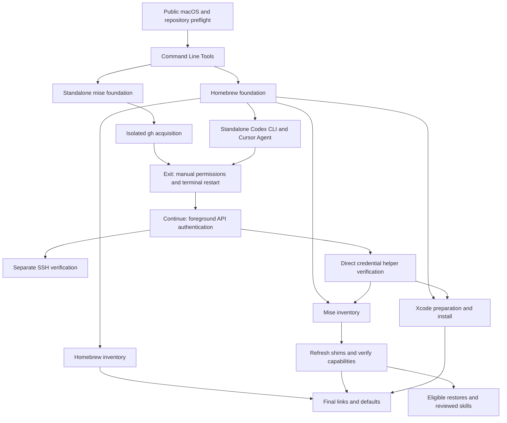

# dotfiles

Source of truth for rebuilding my macOS development environment without
committing secrets, auth state, or machine-local noise.

The main path is intentionally simple:

```bash
mkdir -p ~/development
git clone https://github.com/gabimoncha/dotfiles.git ~/development/dotfiles
cd ~/development/dotfiles
./bin/setup
```

`./bin/setup` prepares foundation tools only: Homebrew, standalone mise, isolated
gh, Codex CLI, and Cursor Agent. It exits before bulk installation so you can
review **System Settings > Privacy & Security > App Management** for your terminal
application and fully quit/reopen it when macOS requests a restart. Then run:

```bash
cd ~/development/dotfiles
./bin/setup --continue
```

Permission approval is manual; setup does not grant or claim to detect it.
Some app-specific prompts may still occur during continuation.

Run `./bin/setup` without `sudo`. The scripts ask for a password only when a
specific privileged macOS or Homebrew step needs it.

Setup first checks the Mac's active Apple or MDM software update catalog. If a
macOS update is available, or if the check result is unknown, setup stops
before authentication or installation. Open System Settings > General >
Software Update, install the public update, restart if required, and rerun
`./bin/setup`. Setup does not install macOS updates or change Beta Updates.

By default, the continuation phase includes the full mobile development stack and overlaps safe
download-heavy work such as Xcode, Homebrew, `mise`, Android Studio, and MAS apps. Use `./bin/setup --continue --skip-mobile-dev` when you do not want
the Xcode/Android downloads on a run, or `./bin/setup --serial` when debugging.

## Setup Steps

### Step 1: Prepare the old Mac

Do this before moving to a new machine, or whenever you want to check whether
the repo still reflects the current Mac.

```bash
cd ~/development/dotfiles
./bin/prepare-sync
./bin/file-backup
```

`bin/prepare-sync` is a drift report, not an auto-writer. It compares the
current Homebrew bundle, prints the current `mise` state, and saves backups
under `.sync-backups/` so changes can be made intentionally.

`bin/file-backup` runs the file-backed state workflow. It copies the small
Mackup allowlist to Synology Drive and mirrors it to iCloud on a best-effort
basis when iCloud is ready, creates the passphrase-encrypted Codex archive, and
opens Raycast with instructions to export an encrypted `.rayconfig` under
`SynologyDrive-personal/MacBackups/Raycast`. The Raycast step prints a full
timestamped save path such as
`raycast-settings-YYYYMMDD-HHMMSS.rayconfig` and copies it to the clipboard when
possible. Rerun `./bin/file-backup raycast` after the Raycast export to mirror
the newest export to iCloud.

If Mackup asks before replacing existing backup copies, pass its option through
the top-level helper:

```bash
./bin/file-backup --force
```

Commit and push any intentional repo changes before switching machines.

Codex CLI itself is not part of the archive. Bootstrap keeps the current
standalone install under `~/.codex/packages/standalone` healthy and removes the
Homebrew cask if it exists. The archive only carries portable user state.

Cursor Agent CLI itself is not part of the archive. Bootstrap keeps its
standalone installer runtime under `~/.local/share/cursor-agent` healthy and
exposes `agent` through `~/.local/bin`; Cursor the app stays a Homebrew cask.

`mise` data is not migrated or restored separately. Bootstrap keeps only the
`mise` binary on the standalone installer path at `~/.local/bin/mise` so
`mise self-update` remains available as an explicit upgrade; setup reuses it;
existing tools, shims, cache, and state stay in the normal `mise` locations.

### Step 2: Clone on the new Mac

```bash
mkdir -p ~/development
git clone https://github.com/gabimoncha/dotfiles.git ~/development/dotfiles
cd ~/development/dotfiles
./bin/setup
```

If Xcode Command Line Tools are missing, setup opens Apple's installer popup
and exits. Finish the installer, then rerun:

```bash
./bin/setup
```

### Step 3: Review permissions, restart the terminal, and continue

After the foundation phase exits, review App Management permission for the
terminal application you will use. Fully quit/reopen that application when
requested, return to this repository, and run `./bin/setup --continue`.
This phase rechecks foundation readiness before proceeding.

`bin/setup` is the fresh-machine entrypoint; `bin/bootstrap` uses the same
planner. Stages have explicit prerequisites and independent failures continue.


```mermaid
flowchart TD
  P[Public macOS and repository preflight] --> C[Command Line Tools]
  C --> B[Homebrew foundation]
  C --> M[Standalone mise foundation]
  M --> G[Isolated gh acquisition]
  B --> ST[Standalone Codex CLI and Cursor Agent]
  G --> Q[Exit: manual permissions and terminal restart]
  ST --> Q
  Q --> A[Continue: foreground API authentication]
  A --> S[Separate SSH verification]
  A --> V[Direct credential helper verification]
  B --> H[Homebrew inventory]
  B --> T[Mise inventory]
  V --> T
  B --> X[Xcode preparation and install]
  V --> X
  T --> R[Refresh shims and verify capabilities]
  H --> F[Final links and defaults]
  R --> F
  X --> F
  R --> E[Eligible restores and reviewed skills]
```

Rerun `./bin/setup --continue` as Apple ID, App Store, iCloud, Synology Drive, Xcode, or
app permissions become ready. The detailed bootstrap inventory is in
[`What Setup Actually Does`](#what-setup-actually-does).

Dry-run the same plan with provisioning disabled. Read-only preflight probes
run and private diagnostic logs are intentionally written:

```bash
./bin/setup --dry-run
./bin/setup --continue --dry-run
```

### Step 4: Authenticate GitHub and restore state

Setup acquires only pinned gh in an isolated configuration, then keeps API
login and SSH setup in the foreground. API failure blocks GitHub-dependent mise
and mobile installs; Homebrew continues. SSH failure is reported separately and
does not invalidate working API credentials. Run individual repairs with:

```bash
./bin/github-bootstrap install-gh
./bin/auth-setup --api-only
./bin/auth-setup --ssh-only
./bin/auth-setup --verify-mise
./bin/file-restore
```

The direct `~/bin/dotfiles-gh-real` credential helper resolves a complete
installed gh version without calling mise or the routing wrapper, including
after upgrades. New SSH keys require a nonempty passphrase; existing identities
and an approved agent remain usable. GitHub host keys are pinned to published
material. Authentication output is not written to diagnostic logs.

Every setup run, including the first run and dry-run, prints a cloud backup
checklist before installation. It lists Mackup, Raycast, and Codex locations in
Synology Drive and iCloud Drive, counts files that need download, and distinguishes
missing locations from unreadable files. Download one provider's copy in Finder
before continuing. This metadata check does not download files or claim that a
backup is valid; Raycast import and Codex decryption still require their passwords.

At the restore stage, setup independently checks real executables, applications
and readable hydrated backups. Missing prerequisites are deferred before any
prompt. Mackup requires a hydrated backup tree; Raycast import remains pending
manual GUI completion. Codex decrypts and validates archive paths before copying
and preserves existing portable state; comparison and conflict staging remain
available through `file-restore codex --dry-run`.

### Multiple GitHub accounts

Account names, commit identities, directory rules, SSH aliases, and key paths
are machine-local and must not be committed. Git identity conditions belong in
`~/.gitconfig.local`, while per-account SSH hosts belong in `~/.ssh/config`.

GitHub CLI has one global active account for each host. The managed `~/bin/gh`
wrapper can select a stored account without changing that global state. Copy
the local routing example and edit the copy with tab-separated values:

```bash
cp ~/development/dotfiles/home/.config/local/github-account-routing.example \
  ~/development/dotfiles/home/.config/local/github-account-routing
```

The `default` row selects the normal account. Each `route` row maps an absolute
or home-relative directory to another stored account. A linked worktree matches
the route through its shared Git directory. The wrapper passes `gh auth ...`
commands through unchanged and respects an explicit `GH_TOKEN` or
`GITHUB_TOKEN`. Git push and pull use SSH configuration and do not depend on
the GitHub CLI account.

`bin/file-restore` restores file-backed state from Synology first, then iCloud
where supported. It restores Mackup-managed app settings, opens the newest
Raycast `.rayconfig` it can find, and prompts before restoring encrypted Codex
state. Targeted commands such as `bin/file-restore codex` still exist for
focused reruns.

Top-level restore options are passed to Mackup, so use this when Mackup asks
before replacing existing local files:

```bash
./bin/file-restore --force
```

If restore unexpectedly falls back from Synology to iCloud, inspect the paths on
that Mac with:

```bash
./bin/file-restore --debug
```

Direct NAS mounts in Finder, such as `ds1522plus/home/MacBackups`, are separate
from the local Synology Drive sync folder. The automated restore path expects
`MacBackups` under `SynologyDrive-personal`; if debug only finds it under
`/Volumes`, fix the Synology Drive Client sync task.

Restore selection rules:

- Mackup restores the current backup tree at
  `SynologyDrive-personal/MacBackups/Mackup`, or falls back to `iCloud Drive/Mackup`.
  It is not timestamped by this repo; use Synology Drive file history if you
  need an older Mackup copy.
- Raycast restores the newest `.rayconfig` by file modification time, checking
  Synology first and then iCloud. Pass an explicit path to restore a different
  export.
- Codex restores `codex-state-latest.tar.gz.age` from Synology first, then the
  newest timestamped Codex archive if `latest` is missing, then iCloud. Pass an
  explicit archive path to restore an older archive.

`bin/finder-sidebar-favorites` creates `~/development` and `~/Screenshots`,
then adds both folders to Finder Favorites. It is run during setup and can be
rerun later if macOS privacy prompts or Finder state get in the way. The
sidebar label is `screenshots`; the folder path remains `~/Screenshots`.

### Step 5: Install personal AI skills

Review `gabimoncha/skills` and install a reviewed version of the `skills` CLI
explicitly before importing skills. Set `DOTFILES_REVIEWED_SKILLS_REF` to the
reviewed 40-character source commit when running setup. Without both, setup
reports skills as deferred rather than executing mutable `skills@latest` code.
The installed `~/.agents/skills` tree and lock file remain machine-local, outside
Git and the encrypted Codex archive. See [execution policy](SETUP-SECURITY.md).

### Step 6: Handle manual account and permission work

Some state cannot be safely automated:

- Apple ID, App Store, and iCloud sign-in
- Cursor, Notion, Synology Drive, superwhisper, and
  DaVinci Resolve sign-in
- Accessibility, Automation, Microphone, and network permissions
- first-run setup for Xcode, Android Studio, OrbStack, and vendor-only apps
- Android Studio SDK setup for React Native: install Android 15 SDK Platform
  35, Sources for Android 35, Android SDK Build-Tools, Android Emulator, and
  create at least one virtual device from Virtual Device Manager

The heavyweight mobile dev stack is part of the default setup path because Xcode
and iOS platform support dominate a fresh-machine run. Skip it when you want a
lighter pass:

```bash
./bin/setup --continue --skip-mobile-dev
```

The dedicated mobile-dev installer remains available for targeted reruns:

```bash
./bin/install-mobile-dev
```

Manual/vendor apps currently live in `apps/manifest.tsv` as `manual` rows.
DaVinci Resolve and Pinokio are examples.

### Step 7: Verify app state

If the machine looks mostly set up but a few pieces feel incomplete, run:

```bash
./bin/app-state-doctor
```

It checks the app-state edges this repo can reason about: AeroSpace and Ghostty
config links, tmux plugins, Raycast install/export state, Touch ID for `sudo`,
and whether Spotlight is still holding Command-Space.

## What Setup Actually Does

`bin/setup` and `bin/bootstrap` share the dependency planner in
`bin/lib/setup-plan.sh`. After public-release preflight and Command Line Tools,
Homebrew and standalone mise start concurrently. gh acquisition starts as soon
as mise is ready. Full mise installation waits for Homebrew availability and
verified API access; it can overlap the Homebrew inventory pass. Writes to each
package manager are serialized across nested helpers. Xcode prepares early;
iOS and Xcode-dependent formulae wait for its successful selection.

Configuration links are created before their consumers and reconciled after
installs. Manifest app failures are aggregated, so one failure does not skip
unrelated apps. A partial mise install still reshims and verifies installed real
executables. Available shell integrations and per-restore readiness are checked
independently. Existing tool installations and link backups are preserved.

Capability probes run offline with provisioning and Corepack downloads disabled.
Each tool lookup and version check has a 10-second deadline (override with
`DOTFILES_TOOL_CHECK_TIMEOUT_SECONDS`); a timeout fails that check and continues
with the next tool. Corepack launchers are reported as unavailable managed tools.
GitHub CLI discovery supports both flattened and retained macOS release archives.

Normal setup streams sanitized command output to the terminal with stage labels
while saving the same output in stage logs. Completion and failure are printed
explicitly; periodic status messages cover quiet operations. Commands run through
pipes may use line-based progress instead of animated terminal progress bars.
Authentication remains interactive and is not written to logs.

Safe parallelism is on by default. `./bin/setup --serial` retains the same
planner and diagnostics. Outcomes are completed, failed, blocked, deferred,
cancelled, or planned. Required failed, blocked or deferred work returns nonzero. Explicit mobile
opt-out and optional restore decisions are reported without failing the run. INT exits 130 and TERM exits 143 after cancelling owned
descendants and releasing locks. Setup preserves display sleep and screen lock.

### Diagnostics and recovery

Setup uses Bash and macOS's `/usr/bin/ruby` for diagnostics and bounded tool
checks. It needs no Perl or Ruby gems, and does not depend on mise runtimes
being installed successfully.

Every normal run and dry-run prints its private `.local/setup-runs/<run-id>/`
directory immediately and in the summary. Inspect `summary.txt`, `events.jsonl`
and individual `*.log` files. JSONL includes mode, timestamps, stage and parent
IDs, prerequisites, duration, status and Bash failure locations. `streams/`
contains the original per-process event streams; IDs carry causality across
parallel output. Dry-run events distinguish executed preflight checks from
planned provisioning. Authentication streams are intentionally omitted, and
captured output is sanitized; review logs before sharing them anyway.

A future agent can locate recent runs with `ls -td .local/setup-runs/*/` and read
the selected run's summary and events. Keep the latest successful run and all
unresolved failure/cancellation runs. After resolving an issue, manually remove
reviewed run directories older than 30 days; setup never silently purges them.
The runtime directory is ignored by Git, and permissions restrict access to the
owner. Gitignore alone does not protect confidentiality.

Repair a failed prerequisite, then rerun setup: no broad mise install starts
until authentication is verified. Explicit upgrades use `mise self-update` or
`./bin/ensure-mise-standalone --update`; normal recovery does not self-update.
[Security and remaining real-machine validation](SETUP-SECURITY.md) covers
optional security products, package execution, disposable environments and
post-compromise backup review.

Touch ID for `sudo` can be managed directly:

```bash
./bin/configure-sudo-touch-id --check
./bin/configure-sudo-touch-id --enable
./bin/configure-sudo-touch-id --disable
```

Skip this during setup when needed:

```bash
DOTFILES_SKIP_SUDO_TOUCH_ID=1 ./bin/setup
```

Apple Watch approval depends on macOS Auto Unlock being enabled in System
Settings. This repo configures the `sudo` Touch ID PAM hook, not Apple Watch
pairing or unlock settings.

The macOS defaults can be skipped for a run:

```bash
DOTFILES_SKIP_MACOS_DEFAULTS=1 ./bin/bootstrap --continue
```

Third-party taps approved for this machine are declared with `trusted: true` in
`Brewfile`. `brew bundle` records that trust persistently, so later Homebrew
commands follow the same reviewed policy. The mobile-dev bundle does the same
for its additional taps. Setup does not disable Homebrew's tap-trust checks
globally.

Run the mobile dev stack separately when you want to repair or repeat only full
Xcode, Android Studio, `applesimutils`, `idb-companion`, and `sourcekitten`:

```bash
./bin/install-mobile-dev
```

The mobile dev installer asks `xcodes` for the latest public release Xcode and
selects it. It enables `xcodes` `--experimental-unxip` by default for faster
unarchiving; set
`DOTFILES_XCODE_EXPERIMENTAL_UNXIP=0` to use regular unxip. After a newer Xcode
is selected, old Xcode apps from other major versions are removed through
`xcodes uninstall`. Set `DOTFILES_KEEP_OLD_XCODES=1` to keep them.

## Apple Release Policy

Use only public release versions of macOS, iOS, iOS simulator runtimes, and
Xcode. Do not enroll a Mac or an iPhone in Apple beta updates. All new Xcode
installs use the latest public release. `./bin/preflight` fails if the macOS
build or an installed Xcode app appears to be a prerelease. Turn off Beta
Updates, install and select public releases, then rerun `./bin/setup`.

Before other environment checks, preflight runs
`softwareupdate --list --product-types macOS` with an English locale. It passes
only when the output has the known no-update result. It stops setup when the
active Apple or MDM catalog offers an applicable update, when the command
fails, or when its human-readable output is not recognized. It does not claim
that the Mac has the newest public release outside that active catalog. It does
not install an update, restart the Mac, change the update catalog, or change
beta enrollment.

Formulae that build from source and trip Homebrew's Xcode minimum check, such
as `borders`, stay in `Brewfile` but are deferred until full Xcode is selected.

## Ownership Model

This repo is deliberately boring about ownership:

- `Brewfile` owns Homebrew formulae, casks, taps, and App Store app entries.
- `home/.config/mise/config.toml` owns language runtimes and global developer
  tools that `mise` supports, including backend-prefixed tools such as
  `gem:fastlane` and `conda:aria2`.
- The Xcodes GUI is managed by mise through `github:XcodesOrg/Xcodes`, selecting
  the latest release's `Xcodes.zip` and preserving its app bundle in mise's
  install directory. The separate `xcodes` CLI remains the mobile setup tool.
- Codex CLI is a standalone-installer exception because remote control and
  app-server updates depend on the installer-managed path under
  `~/.codex/packages/standalone`.
- Cursor Agent CLI is a standalone-installer exception because the official
  installer owns `~/.local/share/cursor-agent` and exposes the `agent` command
  through `~/.local/bin`, while the Cursor GUI remains a Homebrew cask.
- The `mise` binary is a standalone-installer exception because
  `mise self-update` is not available through package-manager installs. Its
  data, tools, shims, cache, and state remain in the normal `mise` locations,
  while setup keeps the standalone runtime current.
- `apps/manifest.tsv` is the typed ledger for cask, formula, and manual/vendor
  install handling.
- `home/` owns files that get symlinked into `$HOME`.
- `macos/defaults.sh` owns conservative macOS defaults.
- `nvim/` is a separate Neovim repo mounted here as a submodule.
- Mackup owns only the allowlisted app settings in `home/.mackup.cfg`, backed
  up to Synology Drive with iCloud as the secondary copy.
- Raycast is restored from an encrypted `.rayconfig` export outside git, with
  Synology primary and iCloud secondary.
- Codex memories and selected user config are restored from an encrypted
  `age` archive outside git, with Synology primary and iCloud secondary.

When adding a tool, use this order:

1. Mac App Store via `mas`, if it is a GUI app available there
2. `mise`, if `mise ls-remote <tool>` or an appropriate backend-prefixed id
   supports it
3. Vendor standalone installer, only for explicit exceptions such as Codex,
   Cursor Agent, and `mise`
4. Homebrew in `Brewfile`, if it does not belong in `mas`, `mise`, or an
   explicit standalone exception
5. `apps/manifest.tsv`, if it needs cask/formula status tracking, post-install
   handling, or manual/vendor follow-up

Do not commit secrets, tokens, private emails, `.rayconfig` files, cache
databases, session state, or machine-local exports.

## Important Paths

```text
Brewfile                         Homebrew, mas, and casks
apps/manifest.tsv                extra cask/formula/manual app ledger
bin/setup                        fresh-Mac entrypoint
bin/bootstrap                    compatibility entrypoint for setup
bin/check-macos-updates          read-only active-catalog macOS update gate
bin/link-dotfiles                symlink managed files into $HOME
bin/ensure-codex-standalone      keep Codex on the standalone installer path
bin/ensure-cursor-agent-standalone
                                 keep Cursor Agent on the standalone installer path
bin/ensure-mise-standalone       keep mise on the standalone installer path
bin/preflight                    repo and machine checks
bin/auth-setup                   GitHub CLI/mise token, Git identity, and SSH setup
bin/configure-sudo-touch-id      Touch ID for sudo PAM setup
bin/install-apps                 manifest installer
bin/install-mobile-dev           heavyweight Xcode and Android Studio setup
bin/finder-sidebar-favorites     add repo-owned Finder sidebar favorites
bin/app-state-doctor             post-setup app-state checks
bin/file-backup                  unified Mackup, Raycast, and Codex file backup
bin/file-restore                 unified Mackup, Raycast, and Codex file restore
bin/*-backup, bin/*-restore      compatibility aliases for file backup/restore
home/                            tracked $HOME sources
home/.config/mise/config.toml    mise-owned tools
home/.cli-proxy-api/config.yaml  secret-free local CLIProxyAPI server config
home/.mackup.cfg                 Mackup allowlist using Synology file storage
macos/defaults.sh                tracked macOS defaults
nvim/                            Neovim submodule linked to ~/.config/nvim
```

## Managed Dotfiles

`bin/link-dotfiles` links tracked files into `$HOME` and backs up replaced
targets under `~/.dotfiles-backups/<timestamp>/`.

Currently managed:

- `~/.gitconfig`
- `~/bin/gh`
- `~/.aerospace.toml`
- `~/.zshenv`, `~/.zprofile`, `~/.zshrc`
- `~/.p10k.zsh`
- `~/.mackup.cfg`
- `~/.rgrc`
- `~/.tmux.conf`
- `~/.cli-proxy-api/config.yaml`
- `~/.config/mise/config.toml`
- `~/.config/zsh/*.zsh`
- `~/.config/karabiner/karabiner.json`
- `~/Documents/superwhisper/settings/settings.json`
- `~/Library/Application Support/com.mitchellh.ghostty/config`
- `~/scripts/toggle_function_keys.sh`
- `nvim/` as `~/.config/nvim`

AeroSpace and Ghostty config links are only created after their app bundles
exist in `/Applications`.

CLIProxyAPI is installed and started by its `Brewfile` entry. Its tracked
config binds the API to `127.0.0.1:49156`; `bin/link-dotfiles` links it to
`~/.cli-proxy-api/config.yaml` and links Homebrew's
`etc/cliproxyapi.conf` to that home path. Provider login files stay local in
`~/.cli-proxy-api` and must not be copied into `home/.cli-proxy-api`.

## Shell Layout

The tracked zsh files are thin entrypoints:

- `home/.zshenv`
- `home/.zprofile`
- `home/.zshrc`
- `home/.config/zsh/path.zsh`
- `home/.config/zsh/env.zsh`
- `home/.config/zsh/profile.zsh`
- `home/.config/zsh/interactive.zsh`
- `home/.config/zsh/aliases.zsh`
- `home/.config/zsh/mise-npx.zsh`
- `home/.config/zsh/functions.zsh`
- `home/.config/zsh/check-updates.zsh`

Machine-local secrets and exports belong in ignored files under:

```text
~/.config/local/*.zsh
home/.config/local/*.zsh
```

Use `home/.config/local/secrets.zsh.example` as the template for repo-local
secret exports. The real `secrets.zsh` file stays untracked.

Use environment variables for secrets and the zsh `path` array for committable
PATH setup.

For staged Git changes, `commit-ai` (or its short alias `gcai`) asks
`gpt-5.6-luna` at low reasoning effort for one concise Conventional Commit
subject based only on the staged file list and patch. Codex runs ephemerally in
a read-only sandbox, then opens a temporary commit-message buffer in Neovim
before Git or any commit hooks run. Save and close with `:wq` to pass the edited
message to `git commit` and run the repository's hooks; close the untouched
generated message with `:q` to abort without running hooks or committing.

Infisical wrappers are available for separate work and personal service tokens:

```zsh
infisical-work run --env=dev -- bun dev
infisical-personal run --env=dev -- npm run dev
infisical-work export --env=prod --format=json
infisical-personal secrets get SOME_KEY --env=dev
```

They support `run`, `export`, and `secrets`, using `INFISICAL_WORK_TOKEN` or
`INFISICAL_PERSONAL_TOKEN` from local secrets. Optional
`INFISICAL_WORK_API_URL` and `INFISICAL_PERSONAL_API_URL` values are passed to
the CLI as `--domain`.

`home/.config/zsh/mise-npx.zsh` wraps `npx` and `px` so one-off npm package CLIs
use the `[settings.npm].package_manager` value resolved by `mise`. The global
default in `home/.config/mise/config.toml` is `bun`, while a project `mise.toml`
can override it to `pnpm` or `aube`. Bun-selected projects delegate directly to
`bunx`. Pnpm-selected projects use `pnpm exec` when the requested binary exists
in local `node_modules/.bin`, otherwise they use `pnpm dlx` for one-off package
commands, with the pnpm path routed through Socket Firewall Free. Use `bx` or
`bunx` when you explicitly want Bun regardless of the project setting, and use
`npx!` for the real npm runner through Socket Firewall Free when npm-specific
behavior or flags are required. The file
includes comments with the minimal adoption steps for sharing it outside this
repo.

Socket Firewall Free is installed as `npm:sfw` through `mise`. Interactive zsh
aliases route supported package managers through it when `sfw` is on `PATH`:
`npm`, `pnpm`, `yarn`, `pip`, `uv`, and `cargo`. Use `command <tool>` for a
single bypass when you need the underlying package manager without the shell
alias. Bun and Bunx are intentionally not wrapped because Socket Firewall Free
does not officially support them.

Socket Firewall Free is a wrapper-mode safety layer, not a full private registry
policy engine. It does not support private/custom registries, does not work
offline, does not allow telemetry to be disabled, and blocks confirmed malware
while warning on AI-detected potential malware.

For Android/React Native development, the tracked shell config exports
`JAVA_HOME` to the Homebrew Zulu 17 JDK and `ANDROID_HOME` to
`~/Library/Android/sdk`, then adds the Android emulator and platform-tools
directories to `PATH`. The JDK `bin` directory is placed before `mise` shims so
Java tools such as `keytool` come from the configured JDK instead of stale
runtime shims. Run `./bin/install-mobile-dev` to install Android Studio. Android
Studio still owns installing the SDK packages and creating the emulator image.

Interactive shell setup uses static mise shims and initializes optional tools
only through real installed executables. It does not call mise activation,
provision missing tools or fetch credentials at prompt initialization. `~/bin`
and `~/.local/bin` keep standalone commands authoritative. Open a new terminal
after changing the managed shell configuration.

To get the Android debug signing SHA-1, use the real debug keystore path:

```bash
keytool -list -v -keystore "$HOME/.android/debug.keystore" -alias androiddebugkey -storepass android -keypass android
```

When a clean shell does not have `mise` shims on `PATH`, prefer:

```bash
mise exec -- <command>
```

## Mackup and Raycast

Mackup uses Synology Drive as primary storage, mirrors to iCloud after backups
on a best-effort basis when iCloud is ready, and restores from iCloud if the
Synology backup is not available yet:

```bash
./bin/file-backup mackup
./bin/file-restore mackup
```

The allowlist currently includes Cursor, Rectangle, Spotify,
OBS, and Stats.
Setup installs OBS through Homebrew; Mackup restores its settings, profiles,
and scenes separately.

Use the helper scripts instead of raw Mackup link mode. This repo treats Mackup
as an explicit copy-based backup/restore tool so tracked files under `home/`
remain the source of truth.

Top-level backup options are passed to Mackup, so use
`./bin/file-backup --force` to replace existing Mackup backup copies during the
combined backup flow.

Raycast is separate and app-driven:

```bash
./bin/file-backup raycast
./bin/file-restore raycast
```

Save `.rayconfig` exports under
`SynologyDrive-personal/MacBackups/Raycast` using the filename printed by
`./bin/file-backup raycast`, for example
`raycast-settings-YYYYMMDD-HHMMSS.rayconfig`. Then rerun
`./bin/file-backup raycast` to mirror the newest export to `iCloud Drive/Raycast`.
Keep `.rayconfig` exports and passphrases outside git.

Codex state is separate from Mackup and Raycast:

```bash
./bin/file-backup codex
./bin/file-restore codex
```

The archive is encrypted with `age -p`, saved to
`SynologyDrive-personal/MacBackups/Codex`, and mirrored to `iCloud Drive/Codex`
when iCloud is ready. It includes curated Codex config, keybindings, rules,
memories, and scheduled task definitions. It deliberately excludes global
skills (which setup installs from `gabimoncha/skills`), auth, connections,
project/workspace state, histories, attachments, caches, sqlite state, plugin
caches, worktrees, sockets, app bundles, raw Codex app global state,
installation IDs, app-server state, and standalone installer packages.

`./bin/file-restore codex` preserves active state by default: missing files are
restored, identical files are skipped, and incoming conflicts are staged under
`~/.dotfiles-backups/<timestamp>/codex-state/incoming`. Use `--dry-run` to
compare an archive first. Use `--replace` only when the archive should
intentionally replace current portable Codex state; current files are backed up
under `~/.dotfiles-backups/<timestamp>/codex-state/current`.

## Neovim

`nvim/` is a git submodule with separate history. `bin/link-dotfiles` links it
to:

```text
~/.config/nvim
```

Do not edit the submodule from this repo unless the task is explicitly about
the Neovim config repo.

## Updating an Existing Mac

Pull repo updates and reapply bootstrap-managed changes:

```bash
dotfiles-update
```

That command runs `git pull --ff-only` and then `bin/bootstrap --continue` with macOS
defaults skipped for the update run.

For targeted reruns:

```bash
./bin/preflight
./bin/bootstrap
./bin/install-apps
./bin/install-mobile-dev
./bin/link-dotfiles
./bin/setup-tmux
./bin/app-state-doctor
```

## Validation

After meaningful changes, run the smallest relevant checks:

```bash
bash -n bin/lib/setup-runtime.sh
bash -n bin/bootstrap
bash -n bin/check-macos-updates
bash -n bin/ensure-codex-standalone
bash -n bin/ensure-cursor-agent-standalone
bash -n bin/ensure-mise-standalone
bash -n bin/install-mobile-dev
bash -n bin/link-dotfiles
bash -n bin/file-backup
bash -n bin/file-restore
bash -n macos/defaults.sh
./tests/check-macos-updates.sh
./tests/setup-runtime.sh
./tests/github-bootstrap.sh
./tests/setup-plan.sh
./tests/setup-restores.sh
./tests/setup-shell.sh
./tests/setup-links.sh
./tests/setup-packages.sh
git diff --check
```

The fixture suites use disposable HOME/config/state directories and fake
external actions; runtime cancellation checks need permission to inspect their
own process trees. They never run real installers or use personal backups.
The planner suite retains its normal/dry-run diagnostics under setup-runs.

The final link step runs after the `mise` tool inventory and standalone agent
installation. It links the tracked global Codex instructions from
`home/.codex/AGENTS.md` to `~/.codex/AGENTS.md`, then links the same source to
`~/.claude/CLAUDE.md`. The shared source keeps both agents aligned.

For manual inspection on the target Mac, these read-only/dry-run commands are
also available (preflight probes the Apple update catalog):

```bash
./bin/preflight
./bin/ensure-codex-standalone --dry-run
./bin/ensure-cursor-agent-standalone --dry-run
./bin/ensure-mise-standalone --dry-run
./bin/install-apps --dry-run
./bin/install-mobile-dev --dry-run
./bin/install-mobile-dev --dry-run --xcode-only
./bin/setup --dry-run
./bin/setup --continue --dry-run
./bin/setup --dry-run --skip-mobile-dev
./bin/setup --dry-run --serial
```

Keep `README.md`, `QUICKSTART.md`, scripts, and tracked config aligned. If the
implementation changes, update the docs in the same patch.

### App permissions, login items, and screenshots

The preparation handoff displays the desired privacy settings from
`apps/permissions.tsv`. Apply these manually in System Settings, then quit and
reopen affected applications when requested. Missing apps can be configured
following installation in `./bin/setup --continue`; the checklist is shown again.
Permissions are never automatically granted or reported as verified.
OBS instructions are stored in `bin/obs-permissions` and `apps/obs-permissions.tsv`.
After OBS installation, the checklist covers Screen & System Audio Recording,
Camera, Microphone, and Input Monitoring. Open OBS's permissions dialog to
request access and approve each request in macOS. Older OBS installations may
use Accessibility for background hotkeys instead of Input Monitoring.

After installation, enable Full Disk Access for ChatGPT, Cursor, Ghostty, Mole,
and Orca in **System Settings > Privacy & Security > Full Disk Access**. macOS
requires this to be an interactive, per-app approval; setup records and displays
the requested state but cannot grant it programmatically.

Continuation adds the apps in `apps/login-items.txt` to Open at Login, preserving
existing entries. System Events may require Automation consent. Missing apps or
failed additions are reported and can be retried with `./bin/configure-app-settings`.
Use `--dry-run` to preview or `--permissions-only` to print the privacy checklist.
Synology Image Assistant is managed as a Homebrew cask; Codex Computer Use is an
application component, not a separately installed package.

`./bin/configure-screenshots` configures the PNG destination preference at `~/Screenshots`
without reapplying other macOS defaults. Continuation runs this every time,
independently of the general defaults stamp. Shift–Command–3/4 saves a file;
Control with those shortcuts copies to the clipboard. Shift–Command–5 > Options
also controls the destination, and dragging a floating thumbnail into an app
can divert the capture from its normal saved-file workflow.

The managed pnpm precedes Node on mise's tool path; Corepack activation is not
part of Node setup. This prevents a bundled download wrapper from shadowing the
already installed pnpm executable.

A successful screenshot configuration stage confirms preference writes, not an
actual capture. If macOS ignores the preference, select `~/Screenshots` through
Shift–Command–5 → Options → Save to → Other Location and verify a saved capture.

Screenshot configuration writes both `location` and `location-screenshot`. The
latter was observed in the working Screenshot toolbar preferences on this Mac;
writing only the generic location left captures going to Desktop. The manual
verification fallback remains because these preferences are OS implementation details.

On macOS 27, the helper also reconciles the toolbar's last destination and file
target settings, accepts equivalent tilde paths without rewriting them, and
verifies each preference after writing it. Both general defaults and setup use
this helper. Regression coverage: `./tests/screenshots.sh`.

Setup finishes background inventory checks before interactive Xcode sign-in.
Xcode installation requires terminal input and prints a sign-in notice; Apple
credentials are excluded from diagnostic logs.

If Xcodes fails during Apple authentication, download the public release `.xip`
from [Apple Developer Downloads](https://developer.apple.com/download/all/),
then run `xcodes install <public-version> --path "/path/to/Xcode.xip" --select
--experimental-unxip`. Use the version matching the downloaded archive; do not
choose beta or RC builds. After installation, resume `./bin/setup --continue`.
Standalone mobile actions record their outcome in the diagnostic summary even
when credential-bearing terminal output is omitted.
